<p align="center">
  
</p>

<p align="center">
  <em>Deterministic threat intelligence correlation. AI only where it earns its cost.</em>
</p>

<p align="center">
  
  
  
  
  
  
</p>

---

ThreatWeave ingests IOCs (IPs, hashes, domains, URLs) and cybersecurity reports
from multiple sources, normalizes them, and correlates them in a knowledge
graph. Its differentiator over a plain feed aggregator is finding relationships
that exact matching misses — via semantic similarity with embeddings — and
explaining them on demand in natural language.

## Table of contents

- [Architecture principle](#architecture-principle)
- [Stack](#stack)
- [Project layout](#project-layout)
- [Configuration](#configuration)
- [Install (development)](#install-development)
- [Running](#running)
- [Web UI (interactive graph)](#web-ui-interactive-graph)
- [Try it locally](#try-it-locally)
- [API](#api)
- [Automated ingestion (feeds)](#automated-ingestion-feeds)
- [Ingesting documents (CLI)](#ingesting-documents-cli)
- [Testing](#testing)
- [Data & security](#data--security)
- [Roadmap](#roadmap)

## Architecture principle

Structural correlation is **deterministic**: a graph, a JOIN, an edge traversal.
AI is reserved for exactly three jobs:

1. extracting TTPs/context from free text (at ingestion),
2. generating embeddings (at ingestion),
3. writing explanatory narratives (on demand, at query time).

The first two touch each datum once, at ingestion; the third runs only when a
narrative is explicitly requested. An LLM is **never** used to correlate IOCs or
decide structural relationships — that is graph logic, and putting AI there would
add cost and hallucinations to data that must be exact. All AI access goes
through a single, swappable `LLMProvider` interface (`extract` / `embed` /
`narrate`).

**Hybrid extraction.** Obvious IOCs (IPs, domains, hashes, URLs) are pulled by
the deterministic regex parser at zero token cost. The LLM is used *only* for
what regex cannot recover — TTPs (mapped to MITRE ATT&CK), the attributed actor
and targeted sectors — so the two never duplicate work.

**Semantic similarity is additive.** Embeddings (computed once per campaign at
ingestion, cached in pgvector) let the graph relate campaigns that read alike but
share no exact IOC. This *augments* the exact-match structural correlation with
scored `semantic_similarity` edges — it never replaces it, and the AI still only
touches each datum once, at ingestion.

**Narratives are on-demand.** Natural-language explanations are generated only
when explicitly requested (`GET /api/narrative`), never during ingestion or
routine queries — so their cost scales with use, not data volume. The narrative
is grounded solely in the already-computed subgraph (the model sees only that
evidence), and every response is stamped with a disclaimer that it is indicative
and requires analyst verification.

**Structured feeds are AI-free.** Feed connectors (OTX, abuse.ch URLhaus /
MalwareBazaar / Feodo Tracker) already deliver indicators in fields, so their
ingestion is pure normalization + a batched, idempotent `MERGE` — **zero** LLM
calls and **zero** embeddings per IOC. AI stays reserved for free-text
`ingest-doc`. (OTX pulse *descriptions* can optionally be embedded for semantic
search via `OTX_EMBED_DESCRIPTIONS`, off by default; a test asserts a structured
feed makes no calls to the AI provider.)

<p align="center">
  
</p>

## Stack

- Python 3.11+, FastAPI
- Neo4j (graph), PostgreSQL + pgvector (embeddings)
- React + Vite + TypeScript frontend with a Cytoscape.js graph view
- Docker Compose for local infrastructure
- Deterministic IOC extraction via regex/parsers (no AI)
- Structured feed connectors (AlienVault OTX, abuse.ch URLhaus / MalwareBazaar / Feodo Tracker)
- Scheduled, idempotent batch ingestion (cron-friendly CLI)
- pytest, ruff, full type hints

## Project layout

```
src/threatweave/
├── config.py            # pydantic-settings, loaded from .env
├── models/              # domain models (IOC, Actor, Campaign, TTP, graph value objects) + normalization
├── parsers/             # deterministic regex IOC parser (+ refanging)
├── connectors/          # ingestion sources: OTX, abuse.ch (URLhaus/MalwareBazaar/Feodo), documents + shared retry
├── graph/               # GraphStore port (incl. batch UNWIND+MERGE upserts) + Neo4j and in-memory adapters
├── vector/              # VectorStore port + pgvector and in-memory adapters + factory
├── correlation/         # correlate() (structural + semantic) and similar()
├── ingest.py            # OTX payload / structured feed / document -> graph (batched, + cached embeddings)
├── ingest_runner.py     # multi-source scheduled ingestion: dedup, per-source isolation, AI-free feeds
├── ingest_state.py      # persistent per-source run state (dedup hash + status), shared CLI <-> API
├── llm/                 # LLMProvider interface + OpenAI provider, Ollama stub, cost, narrative, factory
├── cli.py               # `threatweave` CLI (ingest, ingest-doc, demo)
└── api/                 # FastAPI app, routes and API-key/rate-limit gating (security.py)

frontend/                # React + Vite single-page graph explorer
├── src/api/             # typed API client + error mapping
├── src/graph/           # Cytoscape styling + subgraph merge for expansion
├── src/hooks/           # useGraph (search/expand) and useNarrative (on-demand)
└── src/components/      # SearchBar, GraphView, NodeDetailPanel, NarrativePanel, StatusBanner
```

The graph models five node kinds — `IOC`, `Actor`, `Campaign`, `TTP`, `Sector` —
linked by deterministic relationships (`PART_OF`, `ATTRIBUTED_TO`, `RESOLVES_TO`,
`USES`, `TARGETS`), plus a weighted `SEMANTIC_SIMILARITY` edge (carrying a cosine
score) added at query time from campaign embeddings.

## Configuration

All configuration comes from environment variables. Copy the template and fill
in values (never commit `.env`):

```bash
cp .env.example .env
```

Key variables: `NEO4J_*`, `POSTGRES_*`, `OTX_API_KEY`, `API_*`,
`GRAPH_BACKEND` (`neo4j` | `memory`) and `SEED_SAMPLE`.

**Feeds and scheduled ingestion.** Each source is enabled per `.env`:
`OTX_ENABLED` and `ABUSECH_ENABLED` (the three abuse.ch feeds share one flag).
abuse.ch gates URLhaus and MalwareBazaar behind a single account key
(`ABUSECH_AUTH_KEY`); Feodo Tracker is public. `threatweave ingest --all`
persists a per-source run record to `INGEST_STATE_PATH`
(`data/ingest_state.json`, git-ignored), and `INGEST_INTERVAL_MINUTES` is the
recommended cadence for the cron/Task Scheduler job that drives it.
`OTX_EMBED_DESCRIPTIONS` (default `false`) keeps scheduled OTX ingestion free of
AI calls; set it to `true` to embed pulse descriptions for semantic search.

**API gating and rate limiting.** The `/api/*` routes accept an optional
`X-API-Key` header, enabled only when `API_KEY` is set (unset — the demo — leaves
the API open, so it starts with no keys). Treat this key as **casual gating, not
a secret**: the frontend ships it in its bundle (`VITE_API_KEY`), so it is
readable by anyone loading the page. The real protection for a public deployment
is the per-client rate limit (`API_RATE_LIMIT`, e.g. `60/minute`), which returns
`429` when exceeded. `/health` is always open. For document ingestion,
set the LLM provider: `LLM_PROVIDER=openai`, `LLM_API_KEY=<key>`,
`LLM_MODEL=gpt-4o-mini` (plus optional `LLM_MAX_INPUT_CHARS`,
`LLM_MAX_OUTPUT_TOKENS`, `LLM_MAX_RETRIES`). For semantic similarity, enable a
vector backend: `VECTOR_BACKEND=pgvector` (or `memory`), with
`LLM_EMBED_MODEL=text-embedding-3-small` and `LLM_EMBED_DIM=1536`. Narratives use
a separate, higher-quality model, configurable via
`LLM_NARRATIVE_MODEL=gpt-5.4-mini`. See [.env.example](.env.example) for the full
list.

## Install (development)

```bash
python -m venv .venv
# Windows: .venv\Scripts\activate   |   Unix: source .venv/bin/activate
pip install -e ".[dev]"
```

## Running

### Option A — no Docker, in-memory demo (fastest)

Runs the API against the in-process graph, seeded from the synthetic sample in
`data/samples/`:

```bash
GRAPH_BACKEND=memory SEED_SAMPLE=true uvicorn threatweave.api.app:app --reload
```

Then query a correlation subgraph:

```bash
curl "http://localhost:8000/api/correlate?ioc=malicious.example&depth=2"
```

You should get a JSON subgraph containing the queried indicator, its sibling
IOCs from the same OTX pulse, and the `Synthetic APT-Test Infrastructure`
campaign node, plus the edges linking them.

### Option B — full stack with Docker (Neo4j + Postgres + API)

```bash
docker compose up --build
```

This starts Neo4j (browser UI at http://localhost:7474, Bolt on 7687), a
pgvector-enabled Postgres (reserved for the embeddings phase), and the API on
`http://localhost:8000`. Populate the graph from OTX by running an ingest against
the running Neo4j (requires a valid `OTX_API_KEY`).

## Web UI (interactive graph)

The `frontend/` app is a React + Vite single-page explorer over the API. Search
an IOC to build its correlation subgraph, **click** a node to inspect it in the
side panel, and **double-click** to expand its relationships outward. Campaign
nodes can list their semantic neighbours; IOC nodes can request an on-demand AI
narrative — both degrade gracefully when the corresponding backend is disabled
(as in the no-keys demo). Node colours encode the entity kind, and AI-derived
`semantic_similarity` edges are drawn dashed and carry their cosine score, so
they never blend in with the deterministic structural edges.

## Try it locally

The fastest path — no database, no API keys — is the seeded in-memory demo, which
also serves the built frontend from the same origin:

```bash
# 1. Build the frontend (served by the API from frontend/dist when present)
cd frontend && npm install && npm run build && cd ..

# 2. Launch the API on the seeded in-memory sample graph
threatweave demo            # http://127.0.0.1:8000  (add --reload for dev)
```

Open http://127.0.0.1:8000 and search `malicious.example` or `203.0.113.10`.

For frontend development with hot-reload, run the API and the Vite dev server
side by side (Vite proxies `/api` to the API, so the app is same-origin in both
dev and production):

```bash
threatweave demo                 # terminal 1: API on :8000
cd frontend && npm run dev       # terminal 2: Vite on :5173
```

## API

| Method | Path              | Description                                            |
|--------|-------------------|--------------------------------------------------------|
| GET    | `/health`         | Liveness probe (unauthenticated).                     |
| GET    | `/api/correlate`  | Correlation subgraph for an indicator.                 |
| GET    | `/api/expand`     | Neighbourhood subgraph around any node id.             |
| GET    | `/api/similar`    | Semantic nearest neighbours of an entity.              |
| GET    | `/api/narrative`  | On-demand natural-language explanation for an indicator.|
| GET    | `/api/ingest/status` | Last ingestion outcome per source (time, counts, errors).|

`GET /api/correlate?ioc=<value>&depth=<1..4>` — the indicator type is inferred
from the value (IP, domain, hash or URL). Returns `404` if the indicator is not
in the graph. The response is a `{ "nodes": [...], "edges": [...] }` subgraph.
Add `&semantic=true` (with a vector backend configured) to also include scored
`semantic_similarity` edges (tunable via `&k=` and `&min_score=`).

`GET /api/expand?id=<node_id>&depth=<1..4>` — returns the neighbourhood subgraph
around **any** node (IOC, campaign, actor, TTP or sector), not just a raw
indicator value. This backs interactive exploration in the web UI: click to
select, expand to grow the graph outward. It is pure deterministic traversal
(`GraphStore.neighborhood`), identical across the memory and Neo4j backends — no
AI. Responds `404` when the node id is not in the graph.

`GET /api/similar?id=<entity_id>&k=<n>` — returns the `k` most semantically
similar entities as `[{ "id", "label", "score" }]`, e.g.
`id=campaign:<name>`. Responds `503` if no vector backend is configured, or
`404` if the entity has no stored embedding.

`GET /api/narrative?ioc=<value>` — computes the correlation subgraph, then asks
the LLM to explain it, returning `{ "ioc", "narrative", "model" }` (the `model`
field records which model produced the text). Add `&semantic=true` to also
consider similarity edges. Responds `404` if the indicator is absent, or `503`
if no LLM provider is configured. The narrative always ends with a
verification disclaimer.

`GET /api/ingest/status` — returns the last run of each ingestion source as
`{ "sources": [{ "source", "status", "last_run", "new_iocs", "total_iocs",
"error", "payload_hash" }] }`. It reads the persistent state file written by
`threatweave ingest` (usually a separate scheduler process), so the API surfaces
the freshest run without sharing memory with it. Sources that have never run are
omitted. Pure observability — no graph or AI access.

## Automated ingestion (feeds)

`threatweave ingest` pulls IOCs from structured feeds and writes them to the
graph — efficiently and idempotently, with **no AI**. Indicators are batched into
a single `UNWIND` + `MERGE` per backend (not one transaction per IOC), and the
deterministic node ids make re-ingestion repeatable: nothing is duplicated, and
the same indicator from two feeds resolves to one node (automatic cross-source
correlation). A per-source payload hash skips a feed whose contents are unchanged
since the last run.

```bash
threatweave ingest --all                          # every enabled source
threatweave ingest --source urlhaus --source feodo # a specific subset
```

Sources: `otx`, `urlhaus`, `malwarebazaar`, `feodo`. Each connector handles
network errors, backs off on rate limits (HTTP 429), and — for abuse.ch —
authenticates with `ABUSECH_AUTH_KEY`. Every run is recorded (queryable at
`/api/ingest/status`).

**Cron-friendly.** The command runs once and exits, so any scheduler drives the
cadence (`INGEST_INTERVAL_MINUTES` documents the recommended interval):

```bash
# Linux/macOS cron — every hour
0 * * * * cd /path/to/threatweave && /path/to/.venv/bin/threatweave ingest --all

# Windows Task Scheduler — hourly
schtasks /create /tn ThreatWeaveIngest /tr "threatweave ingest --all" /sc hourly
```

## Ingesting documents (CLI)

`threatweave ingest-doc` ingests an unstructured threat report — a blog post,
CERT advisory or social-media post — from a URL, a file or inline text. It runs
hybrid extraction (regex IOCs + LLM TTPs/actor/sectors) and writes the result to
the graph, building the `Campaign`, `Actor`, `TTP` and `Sector` nodes and their
edges. Requires an LLM provider configured (`LLM_PROVIDER=openai`, `LLM_API_KEY`).

```bash
threatweave ingest-doc --url https://example.com/threat-report
threatweave ingest-doc --file data/samples/threat_report.txt
threatweave ingest-doc --text "APT-Sample phishing campaign targeting finance ..."
```

Each call prints a summary (campaign id, IOC/TTP counts, actor, sectors, and the
estimated token cost is logged). Afterwards the extracted entities are queryable
through `/api/correlate`.

## Testing

The full suite runs offline — no Neo4j, pgvector, Docker, network or API keys
required. Correlation and similarity run against in-memory stores, every feed
connector (OTX and the three abuse.ch feeds) against a mocked transport, and the
LLM provider is fully mocked (fixed extractions and deterministic embeddings), so
extraction, embeddings and document ingestion are tested without any real API
calls. Guardrail tests assert that batched upserts stay idempotent (re-ingestion
never duplicates), that an unchanged feed is skipped, and that structured-feed
ingestion makes **zero** calls to the AI provider:

```bash
pytest          # run tests
ruff check .    # lint
```

## Data & security

- No secrets in the repo — everything via environment variables.
- `.env` is git-ignored; only `.env.example` (names, no values) is committed.
- Real intelligence data stays out of the repo; `data/samples/` holds only
  synthetic or public data.

## Roadmap

- [x] **Phase 1 — Base graph**: project skeleton, deterministic IOC parsing,
  AlienVault OTX ingestion, Neo4j graph model with an in-memory test backend,
  deterministic correlation and a FastAPI query endpoint. No AI. The `LLMProvider`
  interface and the pgvector infrastructure are defined but not yet implemented.
- [x] **Phase 2 — LLM extraction**: hybrid document ingestion (`threatweave
  ingest-doc`) — regex IOCs plus LLM-extracted TTPs (MITRE ATT&CK), actor and
  target sectors via a swappable `OpenAIProvider` (Ollama stub reserved), with
  token-cost logging and structured-output validation. Extraction inserts
  `Campaign`/`Actor`/`TTP`/`Sector` nodes and their edges.
- [x] **Phase 3 — Semantic similarity**: per-campaign embeddings (`embed`),
  computed once at ingestion and cached in a `VectorStore` (pgvector, with an
  in-memory test backend). Adds `similar(entity, k)`, scored
  `semantic_similarity` edges in `correlate()`, and a `GET /api/similar`
  endpoint — relating campaigns that share no exact IOC.
- [x] **Phase 4 — On-demand narratives**: `narrate()` explains a correlated
  subgraph in natural language via a separate, higher-quality model
  (`LLM_NARRATIVE_MODEL`), grounded solely in the subgraph evidence and stamped
  with a verification disclaimer. Exposed at `GET /api/narrative` — generated
  only on request, so cost scales with use, not data volume.
- [x] **Phase 5 — Frontend & hardening**: a React + Vite single-page explorer
  with a Cytoscape.js graph view (search, click-to-inspect, double-click to
  expand via the new deterministic `GET /api/expand`), a node detail panel with
  on-demand narratives, and loading/error states. Ships casual `X-API-Key`
  gating plus per-client rate limiting on the API, and a one-command
  keyless demo (`threatweave demo`, in-memory seeded graph) that also serves the
  built frontend.
- [x] **Phase 6 — Automated feed ingestion**: structured-feed connectors
  (abuse.ch URLhaus, MalwareBazaar, Feodo Tracker) sharing the OTX pattern, with
  network-error handling, rate-limit backoff and fully mocked tests. Batched
  `UNWIND` + `MERGE` upserts make ingestion fast and idempotent; a payload-hash
  dedup skips unchanged feeds. A cron-friendly `threatweave ingest --all` runs
  every enabled source, `GET /api/ingest/status` reports the last run per source,
  and structured feeds stay strictly AI-free (embeddings/extraction remain the
  preserve of free-text `ingest-doc`).
